Windows SMB File Sharing & Access Control Lab

Overview

This project demonstrates the implementation of SMB file sharing between a Windows 11 host and multiple client devices while applying access control through NTFS Permissions and Share Permissions.

The lab was designed to provide hands-on experience with Windows file sharing, authentication, authorization, least privilege principles, and cross-platform access validation using Linux and Android clients.

---

Objectives

- Configure SMB shares on Windows
- Create user-specific access controls
- Configure Share Permissions
- Configure NTFS Permissions
- Implement least privilege access
- Test authentication and authorization
- Validate read-only and read/write access
- Access shares from Linux and Android clients
- Practice infrastructure troubleshooting

---

Environment

Host System

- Windows 11
- SMB Server enabled
- Local Area Network (LAN)

Client Systems

- Linux Mint VM
- OnePlus 8T
- Honor 200 Pro

Tools Used

- smbclient
- Windows File Sharing
- NTFS Permissions
- Share Permissions
- Local Users and Groups
- CX File Explorer
- Command Prompt
- PowerShell
- Termux

---

User Accounts Created

Username| Purpose| Privilege
OnePlus| SMB access for OnePlus device| Standard User
Honor200Pro| SMB access for Honor device| Standard User

---

Lab Topology

Windows 11 Host (192.168.59.187)
│
├── Honor Data
│   └── Honor200Pro (Read/Write)
│
├── OnePlus Data
│   └── OnePlus (Read/Write)
│
└── SharedReadOnly
    ├── Honor200Pro (Read Only)
    └── OnePlus (Read Only)

---

Folder Structure

LabShare/
├── Honor Data
├── OnePlus Data
└── SharedReadOnly

---

SMB Share Configuration

Configured SMB shares on Windows:

- Honor Data
- OnePlus Data
- SharedReadOnly

Enabled

- Password Protected Sharing
- 128-bit Encryption

Disabled

- Public Folder Sharing

---

Permission Model

Share Permissions

Share Permissions control access to folders when accessed over the network.

NTFS Permissions

NTFS Permissions control access to files and folders stored on disk.

Effective Permissions

The most restrictive combination of Share Permissions and NTFS Permissions determines the user's effective access.

Examples:

Share Permission| NTFS Permission| Effective Permission
Full Control| Read| Read
Read| Full Control| Read
Full Control| Full Control| Full Control

---

NTFS Permission Configuration

Honor Data

Configured:

- Honor200Pro → Modify
- Administrators → Full Control
- SYSTEM → Full Control

Removed:

- Authenticated Users
- Users Group Inheritance

Purpose:

- Restrict access to intended users only
- Enforce least privilege
- Prevent unauthorized access

---

Access Verification

User| Share| Permission
Honor200Pro| Honor Data| Read/Write
OnePlus| OnePlus Data| Read/Write
Honor200Pro| SharedReadOnly| Read Only
OnePlus| SharedReadOnly| Read Only

Validation Results

- Successfully authenticated SMB users
- Successfully validated read/write access
- Successfully validated read-only access
- Confirmed NTFS permission enforcement
- Confirmed Share Permission enforcement
- Verified cross-platform SMB connectivity

---

Linux and Android SMB Access

Linux SMB Client

Connected using:

smbclient //192.168.x.x/"Honor Data" -U Honor200Pro

Commands Tested

- ls
- cd
- mkdir
- put
- get
- del
- help

Validated Operations

- Authentication
- Directory Listing
- File Upload
- File Download
- File Deletion
- Directory Creation

Android Validation

SMB access was successfully tested using:

- CX File Explorer
- Termux
- smbclient

This confirmed interoperability between Windows, Linux, and Android SMB clients.

---

Security Concepts Practiced

- Least Privilege
- Authentication vs Authorization
- NTFS Permissions
- Share Permissions
- Access Control
- Password Protected Sharing
- Hidden Administrative Shares
- Service Exposure Awareness
- Cross-Platform Authentication

---

Troubleshooting Performed

Issues Encountered

- Authentication failures
- Permission inheritance confusion
- SMB access behavior after disabling network discovery
- Linux path and file handling mistakes
- File transfer errors

Resolution Methods

- Verified user credentials
- Reviewed NTFS permission entries
- Reviewed Share Permissions
- Tested SMB sessions directly
- Compared service behavior against GUI settings
- Validated effective permissions through real-world testing

---

Key Observations

- Network Discovery being disabled does not fully disable SMB access.
- SMB services continue running until manually stopped or the system is shut down.
- Administrative shares (C$, ADMIN$, V$) remain visible during enumeration.
- Linux SMB tools provide detailed visibility into available shares and permissions.
- Effective permissions are determined by both NTFS and Share Permissions.

---

Skills Demonstrated

- Windows Administration
- SMB Configuration
- Windows User Management
- NTFS Permissions
- Share Permissions
- Network Authentication
- Access Control
- Cross-Platform Networking
- Linux SMB Administration
- Infrastructure Troubleshooting
- Remote File Operations
- Operational Security Awareness

---

Result

Successfully implemented a secure SMB file sharing environment with:

- Isolated user access
- Working NTFS permissions
- Working Share permissions
- Cross-platform access validation
- Secure authenticated file sharing
- Practical infrastructure troubleshooting

The lab demonstrated real-world Windows file sharing administration while reinforcing access control, authentication, authorization, and least privilege security principles.

---

## Screenshots

### 1. Windows Host IP Configuration
Verified the Windows host IP address used for SMB connectivity.

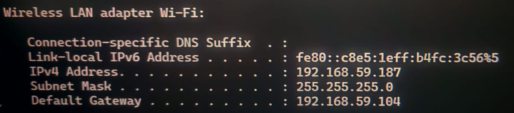

---

### 2. Honor200Pro Share Permission
Configured share-level permissions for the Honor200Pro SMB account.

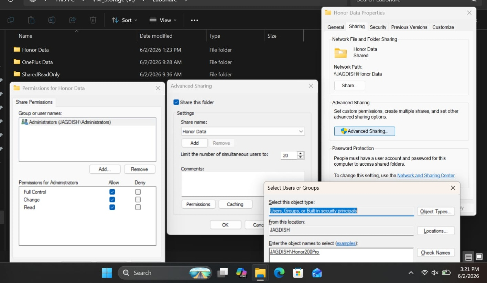

---

### 3. OnePlus Share Permission
Configured share-level permissions for the OnePlus SMB account.

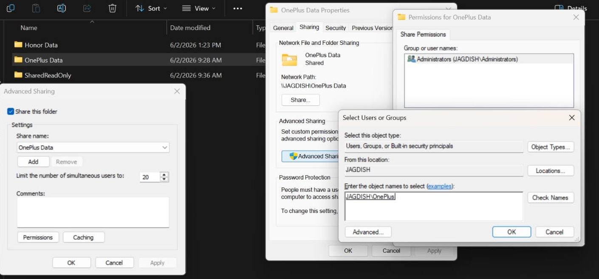

---

### 4. SharedReadOnly Share Configuration
Created and configured the SharedReadOnly SMB share.

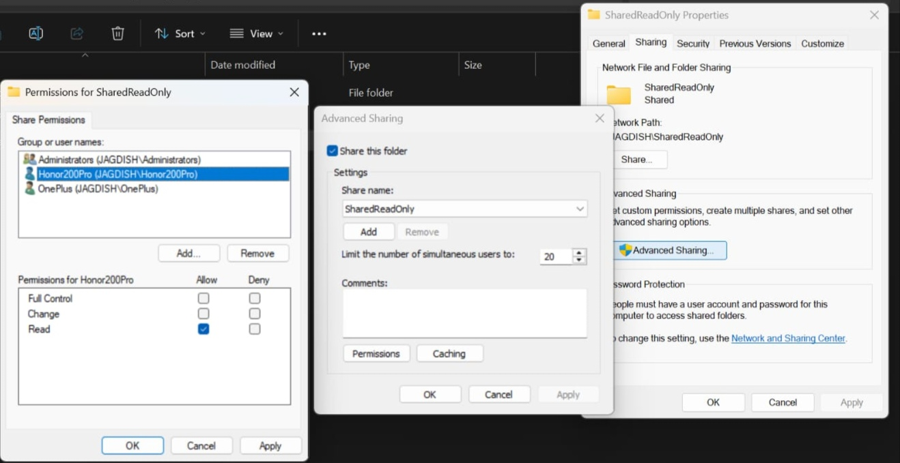

---

### 5. SharedReadOnly Access Validation
Validated read-only permissions for authorized users.

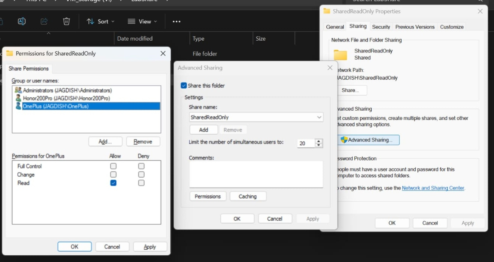

---

### 6. Android SMB Share Enumeration
Enumerated available SMB shares from Android.

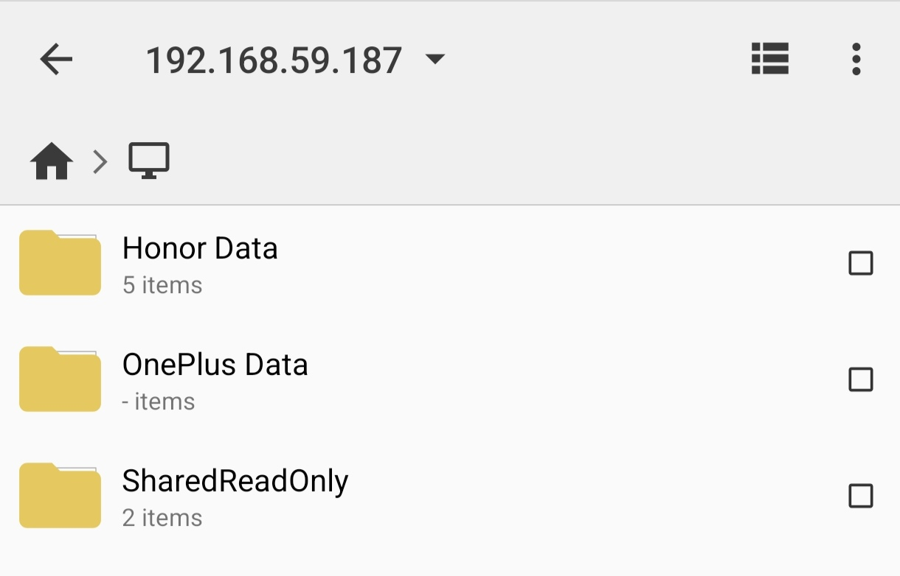

---

### 7. Android SMB Share Access
Successfully accessed SMB shares from Android.

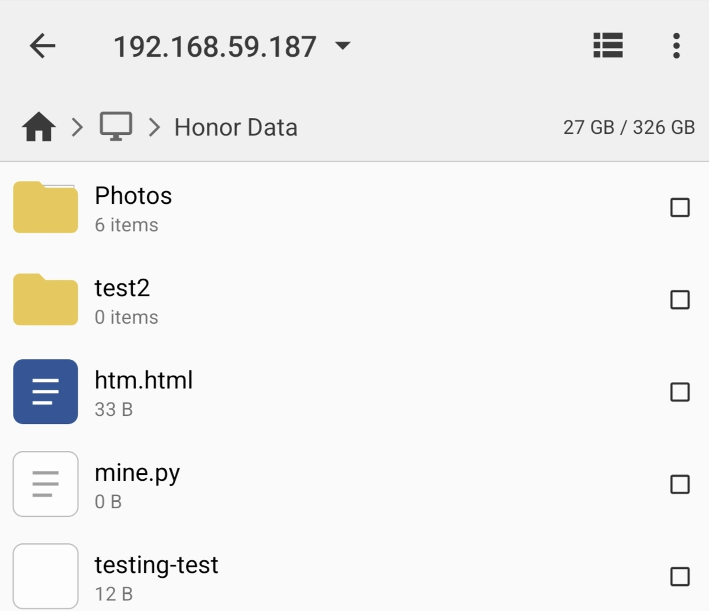

---

### 8. Shared Files Verification
Verified visibility and accessibility of shared files.

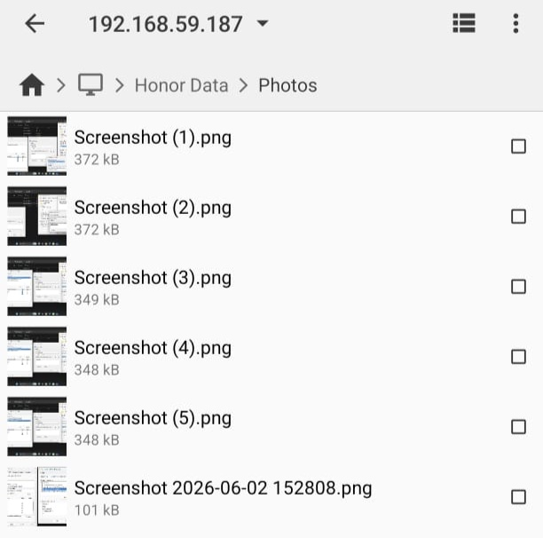

---

### 9. CX File Explorer SMB Setup
Configured SMB connectivity using CX File Explorer.

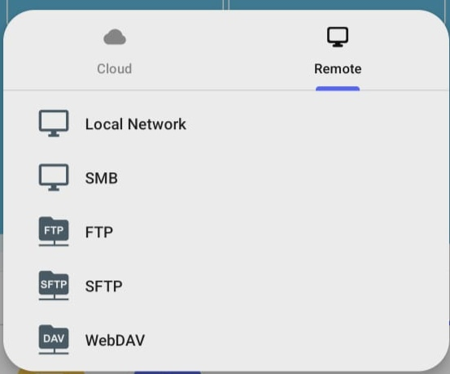

---

### 10. SMB Login Configuration
Configured SMB authentication credentials on Android.

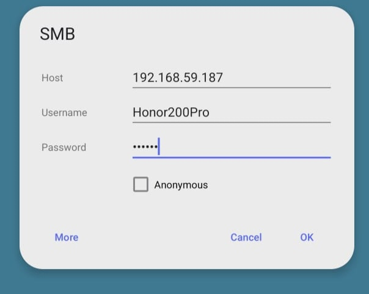

---

### 11. NTFS Permission Configuration
Configured NTFS permissions to enforce least-privilege access.

---

### 12. Administrator Permission Review
Verified effective share permissions from the administrator perspective.

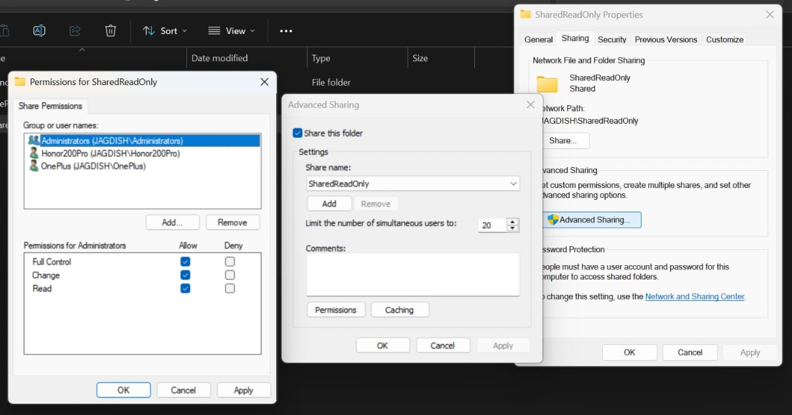

---

### 13. SMB Client Connection
Established SMB connectivity from Linux using smbclient.

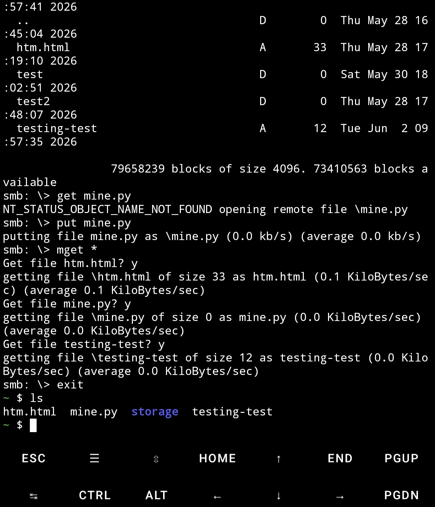

---

### 14. SMB Directory Listing
Enumerated files and directories on the remote SMB share.

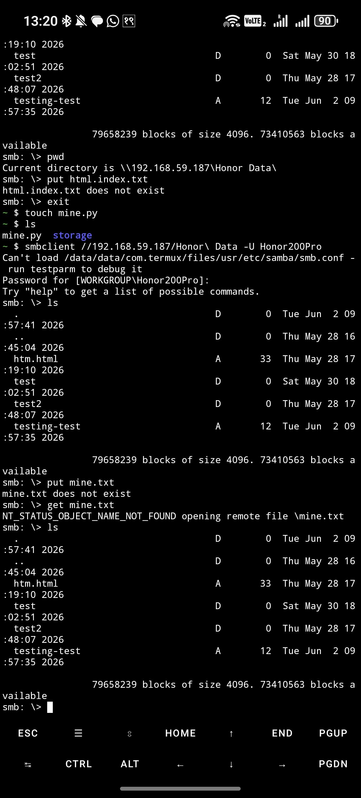

---

### 15. SMB Navigation
Navigated through directories using smbclient commands.

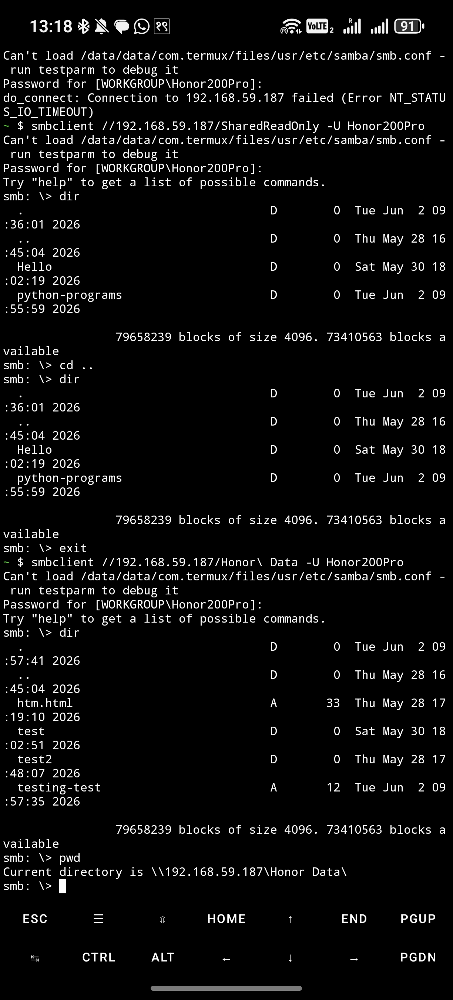

---

### 16. SMB File Operations
Tested file upload, download, and management operations.

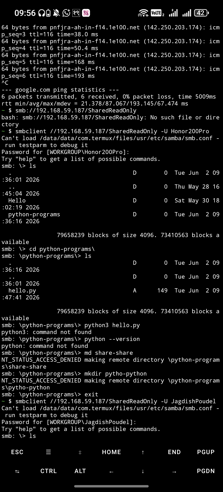

---

### 17. SMB Access Validation
Validated authentication and authorization using assigned credentials.

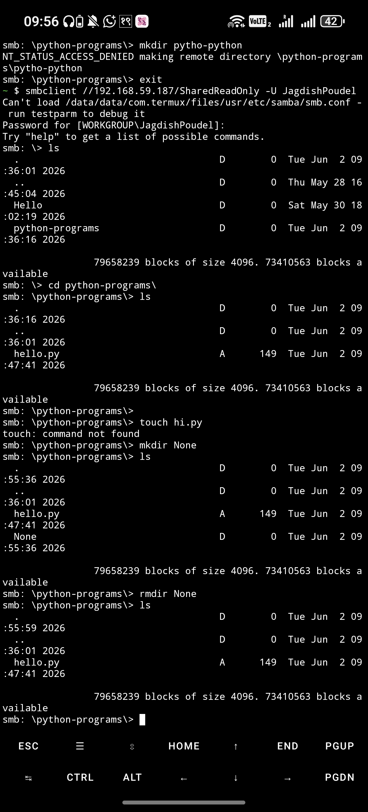
