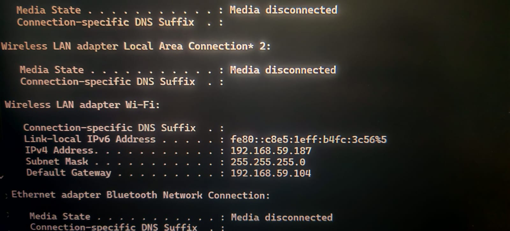
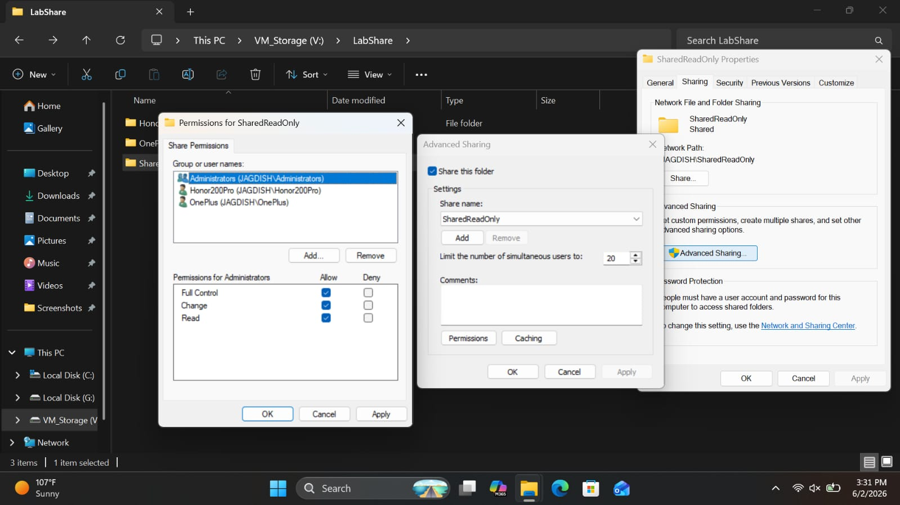
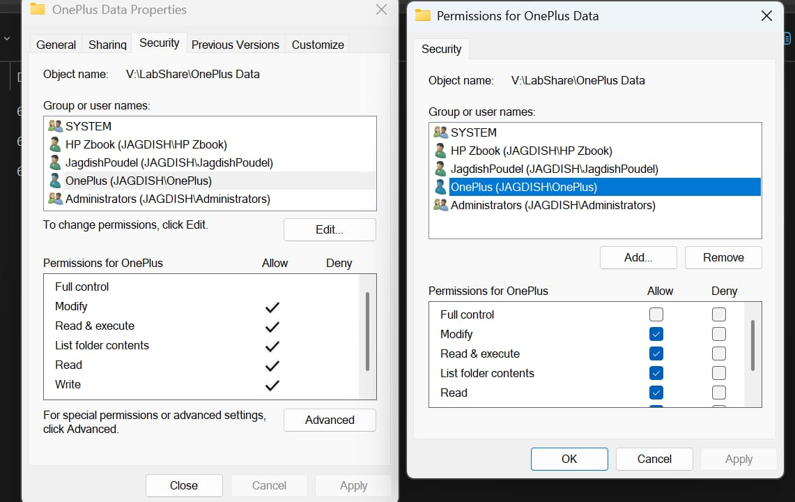
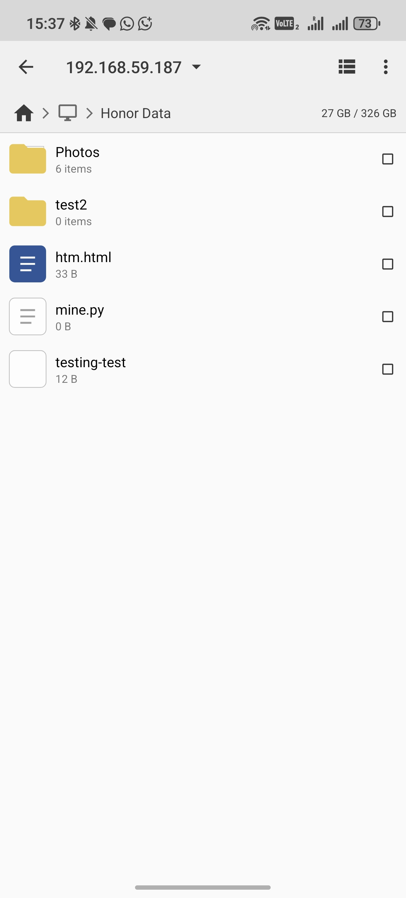

# Windows SMB File Sharing & Access Control Lab

## Overview

This project demonstrates SMB file sharing between a Windows host and Android devices using SMB authentication, Share Permissions, and NTFS Permissions.

## Objectives

- Configure SMB shares
- Create user-specific access controls
- Configure Share Permissions
- Configure NTFS Permissions
- Test authentication
- Validate read-only and read/write access
- Access shares from Android

## Environment

Server:
- Windows 11

Clients:
- Honor 200 Pro
- OnePlus 8T

Tools:
- SMB
- Windows File Sharing
- Cx File Explorer
- Termux

## Lab Topology

Windows 11 Host (192.168.59.187)
│
├── Honor Data
│   └── Read / Write (Honor200Pro)
│
├── OnePlus Data
│   └── Read / Write (OnePlus)
│
└── SharedReadOnly
    ├── Honor200Pro → Read Only
    └── OnePlus → Read Only

## Access Verification

| User | Share | Permission |
|--------|--------|------------|
| Honor200Pro | Honor Data | Read/Write |
| OnePlus | OnePlus Data | Read/Write |
| Honor200Pro | SharedReadOnly | Read Only |
| OnePlus | SharedReadOnly | Read Only |

## Skills Demonstrated

- SMB File Sharing
- Windows User Management
- Share Permissions
- NTFS Permissions
- Network Authentication
- Access Control
- File Transfer Validation
- Android-to-Windows Connectivity
- Basic Troubleshooting

## Lessons Learned

- Share permissions and NTFS permissions work together.
- The most restrictive permission always applies.
- SMB authentication requires valid Windows user credentials.
- Android devices can access SMB shares using third-party file managers.
- Proper permission design allows read-only and read/write access for different users.

## Screenshots

### 1. Windows IP Configuration

### 2. Share Permission - Administrator

### 3. NTFS Permission

### 4. OnePlus Share Permission

### 5. Read Only Share Permission

### 6. Android SMB Share Access

### 7. Android SMB Login

