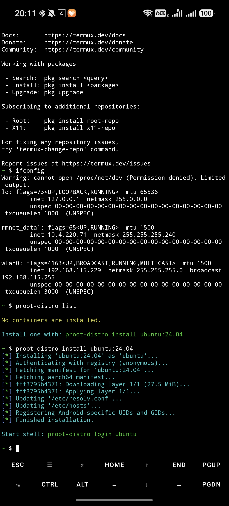
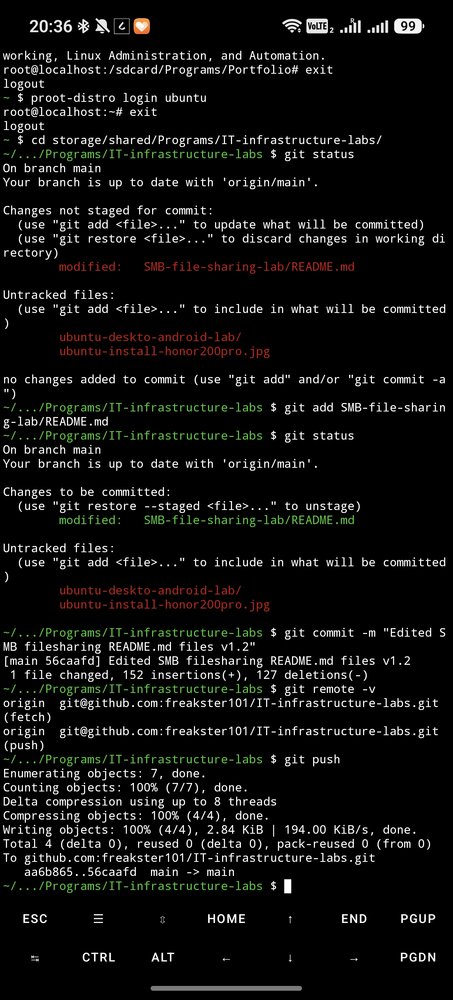
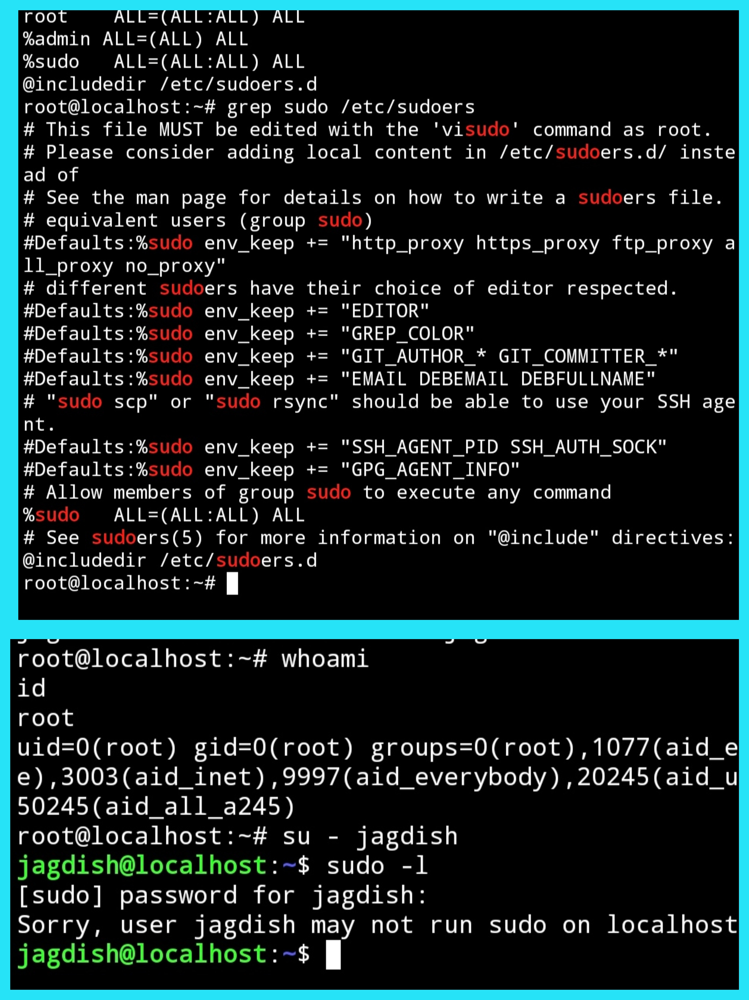
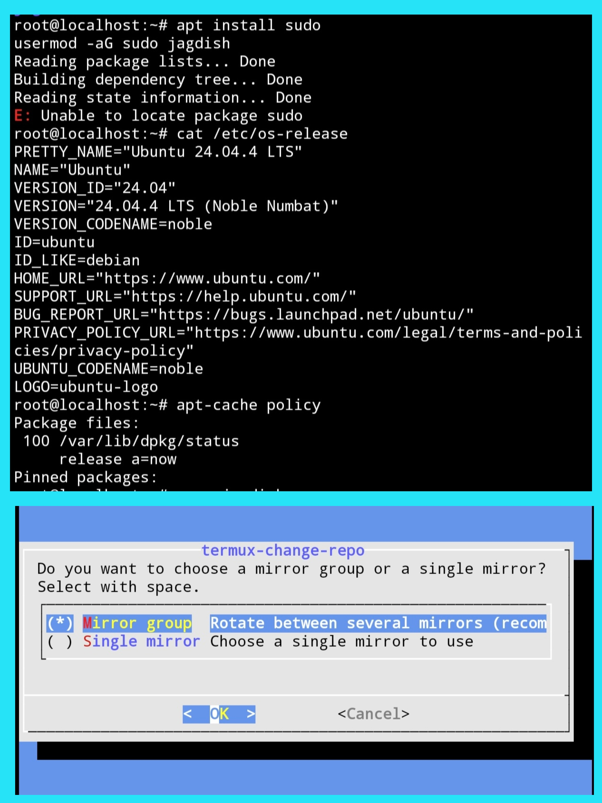
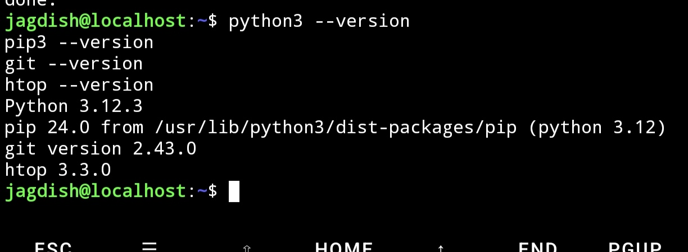
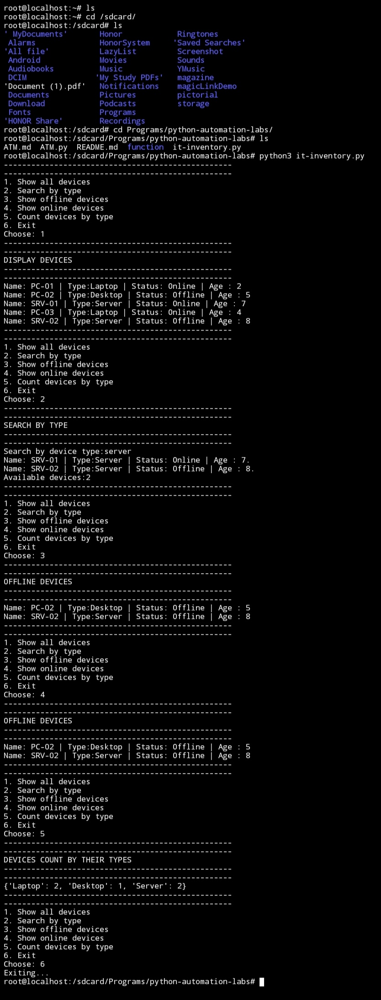
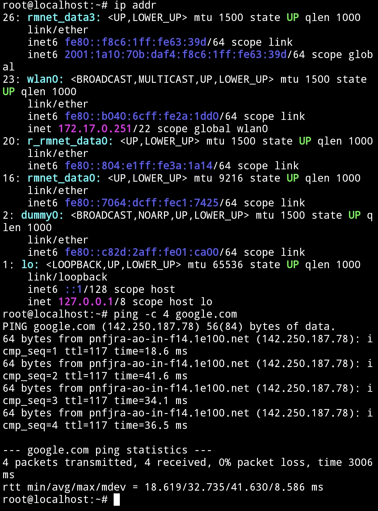
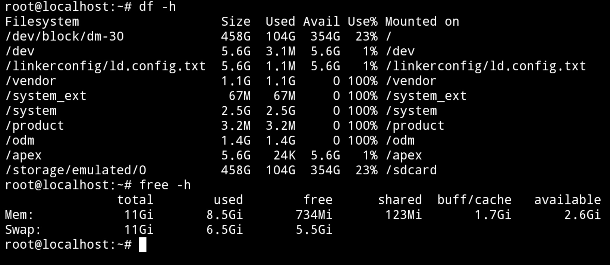
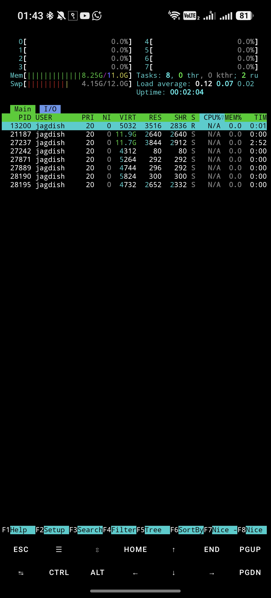
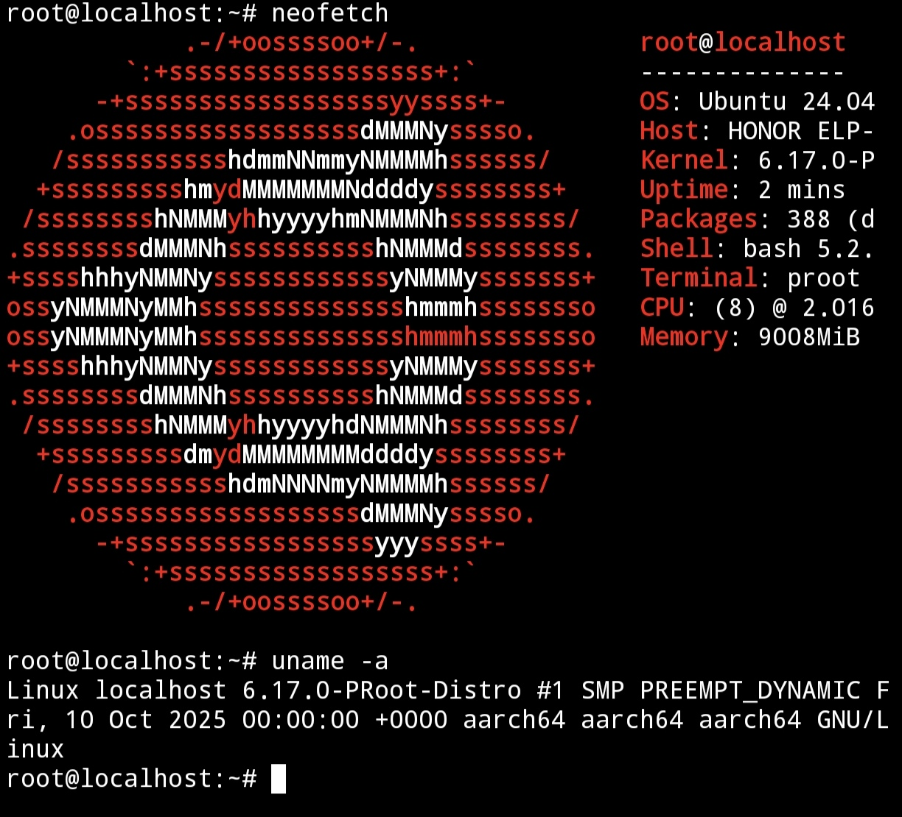

# Ubuntu 24.04 LTS CLI Lab on Honor 200 Pro (Non-Rooted Android)

## Overview

This project documents the deployment, troubleshooting, and administration of a full Ubuntu 24.04 LTS environment running on a non-rooted Honor 200 Pro using Termux and Proot-Distro.

The primary objective was to build a portable Linux workstation for learning Linux administration, networking, Git/GitHub workflows, Python development, and automation directly from an Android device without root access.

Unlike a simple installation guide, this lab involved multiple troubleshooting scenarios including repository failures, sudo permission issues, package management problems, and a complete environment rebuild.

---

## Hardware Specifications

| Component | Details |
|------------|------------|
| Device | Honor 200 Pro |
| RAM | 12 GB |
| Storage | 512 GB |
| Root Access | No |
| Architecture | ARM64 (aarch64) |

---

## Software Stack

### Android Environment

- Termux
- Proot-Distro

### Linux Environment

- Ubuntu 24.04.4 LTS (Noble Numbat)
- Bash Shell

### Development Tools

- Python 3.12
- Pip 24
- Git 2.43
- GitHub
- htop
- Neofetch

---

## Project Goals

- Deploy Ubuntu 24.04 LTS on a non-rooted Android device
- Learn Linux system administration
- Configure user accounts and permissions
- Troubleshoot repository and package management issues
- Practice Git and GitHub workflows
- Develop Python automation projects
- Build a portable CLI-based Linux learning environment

---

# Lab Journey

## Phase 1: Initial Ubuntu Deployment

Ubuntu 24.04 LTS was installed using Proot-Distro inside Termux.

The installation completed successfully and provided a functional Linux environment without requiring root access.

### Screenshot



---

## Phase 2: Git and GitHub Integration

Git was configured and connected to GitHub repositories.

The environment is now regularly used for:

- Repository management
- Documentation updates
- Project version control
- GitHub push/pull operations

### Screenshot



---

## Phase 3: Sudo Troubleshooting

After creating a normal user account, sudo privileges were unavailable.

### Issue

```bash
Sorry, user jagdish may not run sudo on localhost
```

### Investigation

- Verified sudo installation
- Checked sudoers configuration
- Examined group memberships
- Validated user permissions

### Resolution

The user account was properly added to the sudo group and permissions were verified.

### Skills Demonstrated

- User management
- Group management
- Privilege escalation troubleshooting
- Linux permissions

### Screenshot



---

## Phase 4: Repository Mirror Troubleshooting

Package installation began failing due to repository configuration problems.

### Symptoms

- Missing packages
- Package lookup failures
- Repository synchronization issues

### Investigation

- Verified Ubuntu release information
- Checked APT configuration
- Examined repository status
- Updated mirror configuration

### Resolution

Repository mirrors were corrected and package management functionality was restored.

### Skills Demonstrated

- APT troubleshooting
- Repository management
- Package administration

### Screenshot



---

## Phase 5: Environment Verification

Core development tools were installed and verified.

### Verified Components

- Python 3.12
- Pip 24
- Git 2.43
- htop

### Screenshot



---

## Phase 6: Python Development

The environment is actively used for Python scripting and automation practice.

Example project demonstrated:

- Device inventory management
- Menu-driven CLI programs
- Data filtering
- Device categorization

### Skills Demonstrated

- Python fundamentals
- Functions
- Loops
- Dictionaries
- CLI application development

### Screenshot



---

## Phase 7: Network Verification

Connectivity testing was performed to validate networking functionality.

### Commands Used

```bash
ip addr
ping google.com
```

### Verified

- Network interfaces
- IPv4 connectivity
- DNS resolution
- Internet access

### Screenshot



---

## Phase 8: Storage and Memory Monitoring

System resource utilization was analyzed.

### Commands Used

```bash
df -h
free -h
```

### Verified

- Disk availability
- RAM usage
- Swap utilization
- Mounted filesystems

### Screenshot



---

## Phase 9: Process Monitoring

System processes were monitored using htop.

### Skills Demonstrated

- Process management
- Resource monitoring
- Linux performance analysis

### Screenshot



---

## Phase 10: System Information Verification

The environment was validated using system information tools.

### Commands Used

```bash
neofetch
uname -a
```

### Verified

- Ubuntu version
- Kernel information
- Architecture
- Hardware resources

### Screenshot



---

# Skills Demonstrated

## Linux Administration

- User management
- Group management
- Sudo configuration
- Package management
- Repository maintenance
- System monitoring

## Networking

- Interface inspection
- Connectivity testing
- DNS verification
- Route validation

## Git & GitHub

- Repository management
- Commit workflows
- Push operations
- Documentation maintenance

## Python Development

- CLI applications
- Automation scripts
- Data structures
- Problem solving

## Troubleshooting

- Permission issues
- Repository failures
- Package installation issues
- Environment recovery

---

# Frequently Used Commands

```bash
apt update
apt upgrade

git status
git add
git commit
git push

python3
pip3

ip addr
ping

df -h
free -h

htop
neofetch
uname -a
```

---

# Lessons Learned

- Troubleshooting is one of the most valuable Linux skills.
- User permissions are a common source of administrative issues.
- Repository configuration directly affects package management.
- A lightweight CLI environment is often more reliable and efficient than a graphical desktop on mobile hardware.
- Android devices can serve as capable Linux learning platforms when paired with Termux and Proot-Distro.

---

# Future Plans

- Bash scripting
- Python automation
- Linux administration labs
- Networking labs
- SSH management
- Infrastructure projects
- Security-focused Linux learning

---

# Conclusion

This lab demonstrates the successful deployment and administration of Ubuntu 24.04 LTS on a non-rooted Honor 200 Pro using Termux and Proot-Distro.

The project provided hands-on experience with Linux administration, troubleshooting, networking, Git/GitHub workflows, and Python development while operating entirely from a smartphone.

The resulting environment functions as a portable Linux workstation for continuous learning in infrastructure, networking, automation, and future cybersecurity studies.