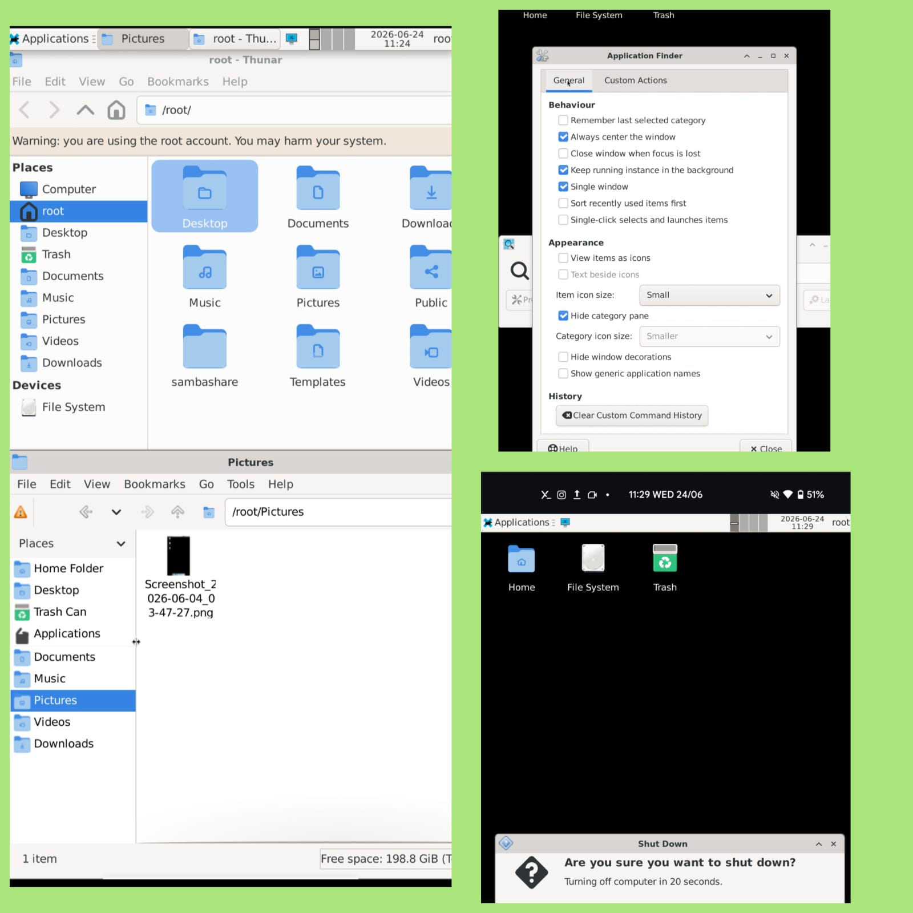
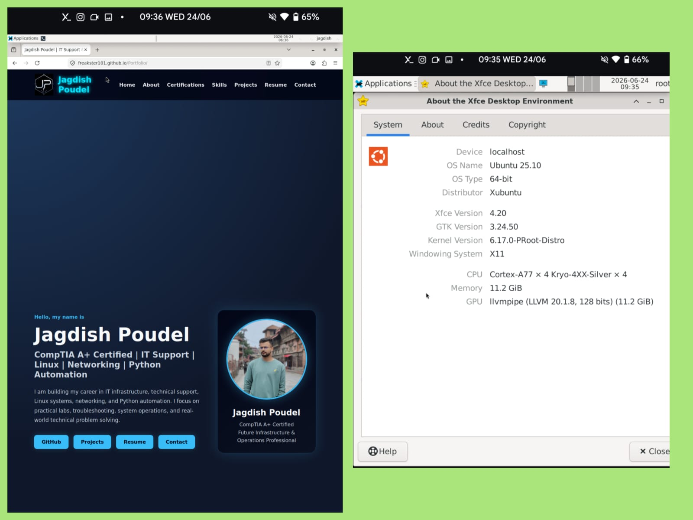
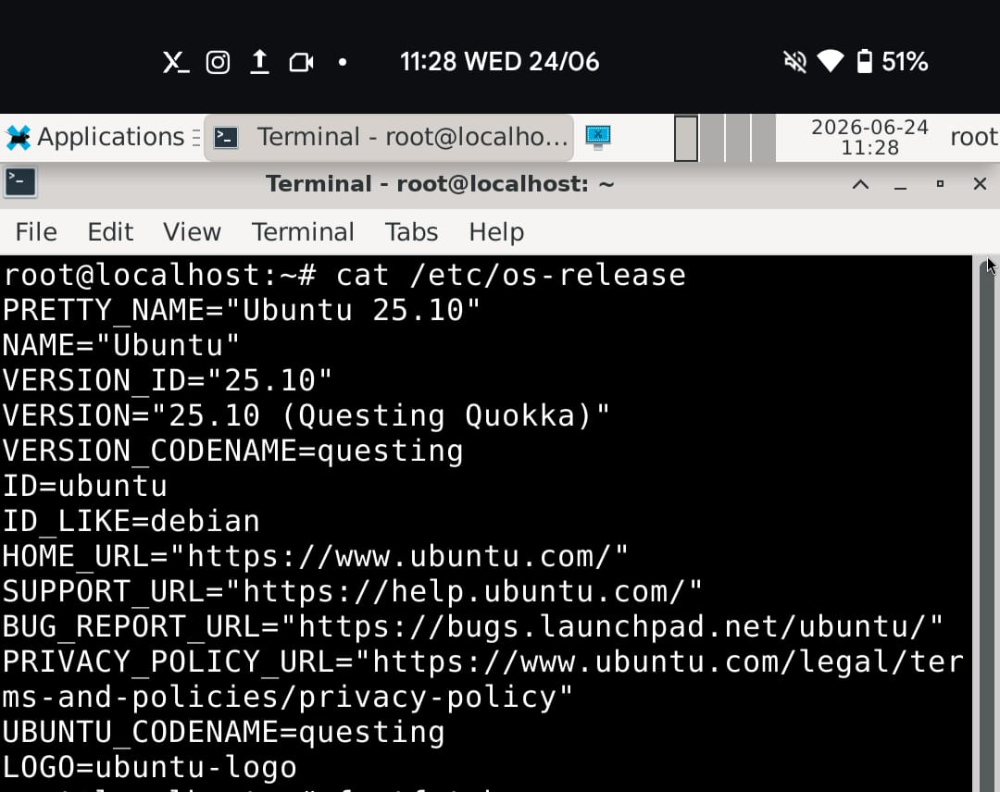
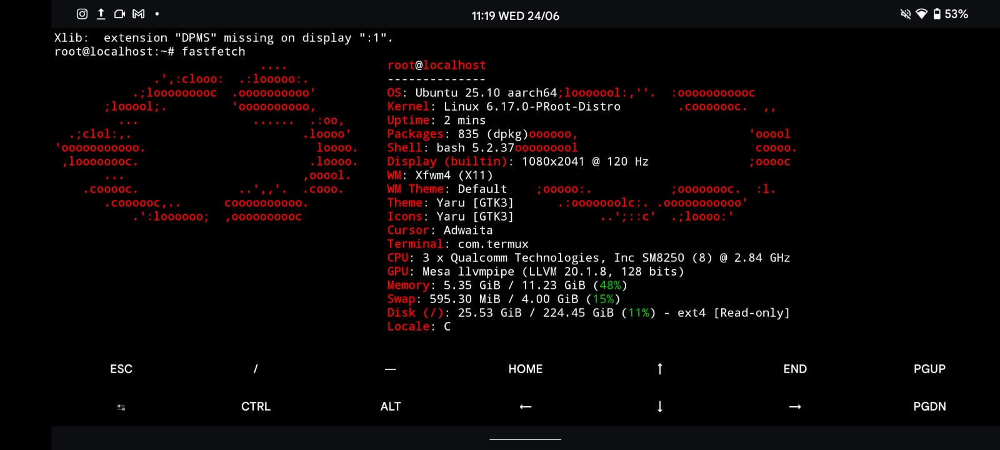
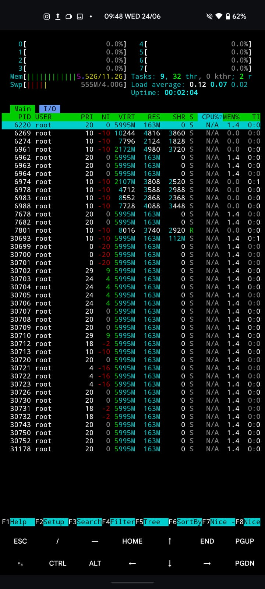
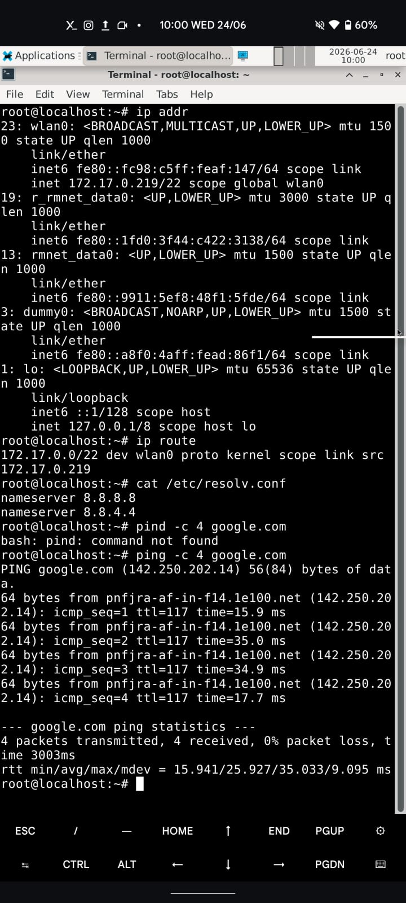
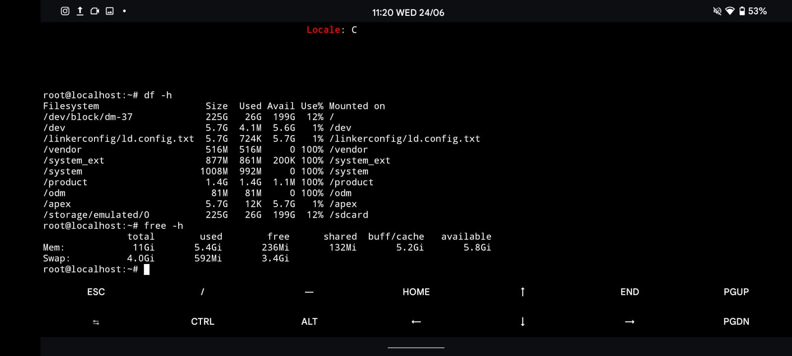
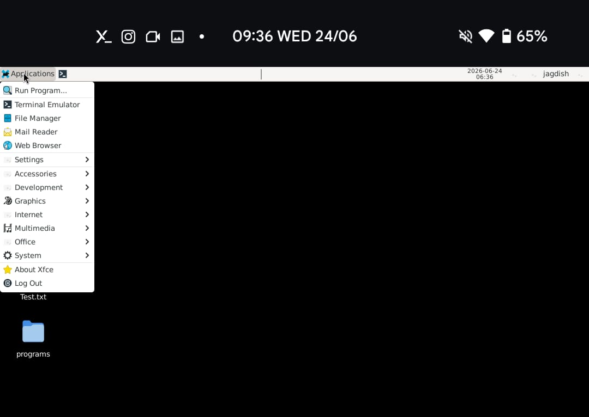

# OnePlus-8T-Termux-X11

## Overview

This lab documents the transformation of a rooted OnePlus 8T running Android 14 (crDroid 10.9) into a portable Linux workstation using Termux, Ubuntu, XFCE, and Termux-X11.

The objective of this project was to build a functional Linux desktop environment on Android for learning Linux administration, networking, troubleshooting, package management, and general infrastructure concepts without requiring dedicated hardware.

The environment provides a lightweight graphical Linux desktop capable of running terminal tools, graphical applications, web browsers, file management utilities, and networking tools.

---

## Lab Objectives

- Deploy a Linux environment on Android
- Install Ubuntu using Proot-Distro
- Configure XFCE desktop environment
- Configure graphical access using Termux-X11
- Manage Linux users and permissions
- Install and manage software packages
- Verify networking functionality
- Monitor system resources
- Explore Linux desktop administration
- Create a portable learning environment for infrastructure and Linux studies

---

## Hardware

| Component | Details |
|------------|------------|
| Device | OnePlus 8T |
| SoC | Qualcomm Snapdragon 865 |
| RAM | 12 GB |
| Storage | 256 GB |
| Root Access | Yes |
| Android Version | Android 14 |
| ROM | crDroid 10.9 |

---

## Software Stack

| Component | Version |
|------------|------------|
| Android | 14 |
| Termux | Latest Stable |
| Proot-Distro | 5.1.4 |
| Ubuntu | 25.10 (Questing Quokka) |
| XFCE | 4.20 |
| Windowing System | X11 |
| Display Server | Termux-X11 |
| Shell | Bash 5.2 |
| Kernel | 6.17.0-Proot-Distro |

---

## Architecture

```text
OnePlus 8T
│
├── Android 14 (crDroid 10.9)
│
├── Root Access
│
├── Termux
│
├── Proot-Distro
│
├── Ubuntu 25.10
│
├── XFCE 4.20
│
└── Termux-X11
```

---

## Features Tested

### Desktop Environment

- XFCE Desktop
- XFCE Application Menu
- Desktop Icons
- Window Management
- Terminal Emulator
- File Manager

### Package Management

- apt update
- apt upgrade
- apt install
- Package verification

### Networking

- Interface inspection
- Routing verification
- DNS configuration
- Internet connectivity testing

### Resource Monitoring

- htop
- free
- df
- fastfetch

### Applications

- Firefox
- XFCE Utilities
- Terminal Tools
- File Manager (Thunar)

---

## Limitations

This environment runs inside a Proot container.

Because systemd is not PID 1, commands such as:

```bash
systemctl
hostnamectl
```

do not function as they would on a native Linux installation.

Example:

```text
System has not been booted with systemd as init system (PID 1)
```

This is an expected limitation of Proot-based Linux environments.

---

# Screenshots

## XFCE Desktop & File Management



XFCE desktop environment running on Ubuntu 25.10 with Thunar file manager.

---

## XFCE Information & Firefox Browser



Verification of:

- XFCE 4.20
- Ubuntu 25.10
- X11 Display Server
- Firefox graphical application

---

## Ubuntu Version Verification



Verification of Ubuntu release information using:

```bash
cat /etc/os-release
```

---

## System Information (Fastfetch)



Displays:

- Operating System
- Kernel Version
- CPU Information
- Memory Usage
- Desktop Environment
- Display Information

---

## Resource Monitoring



Real-time monitoring using:

```bash
htop
```

---

## Network Verification



Networking validation using:

```bash
ip addr
ip route
ping google.com
```

Verifies:

- Active network interfaces
- Routing table
- DNS resolution
- Internet connectivity

---

## Storage & Memory Usage



System resource verification using:

```bash
df -h
free -h
```

---

## XFCE Application Menu



XFCE application launcher demonstrating available desktop utilities and graphical applications.

---

## Skills Demonstrated

- Linux Administration
- Ubuntu Management
- Package Management
- Linux Networking
- Resource Monitoring
- Linux Troubleshooting
- Desktop Environment Configuration
- Android/Linux Integration
- Rooted Android Administration
- Infrastructure Lab Building

---

## Future Improvements

- SSH Server Configuration
- Samba File Sharing
- NFS Shares
- Docker (where supported)
- Python Automation Scripts
- Monitoring Tools
- Multi-user Configuration
- Backup Automation

---

## Author

**Jagdish Poudel**

CompTIA A+ Certified

Focused on:

- Linux
- IT Infrastructure
- Networking
- Technical Support
- Python Automation
- Future Infrastructure & Operations Engineering