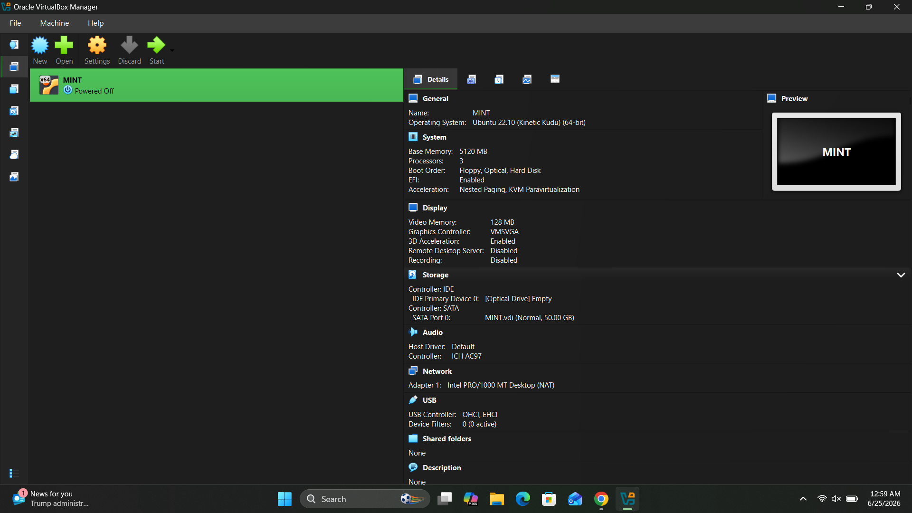
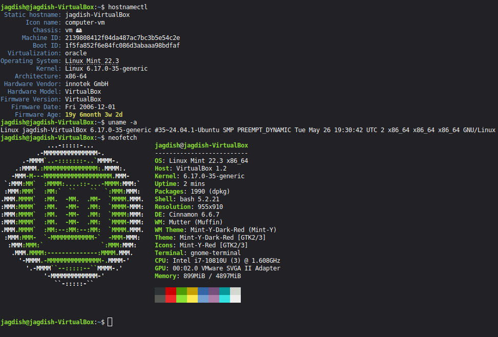
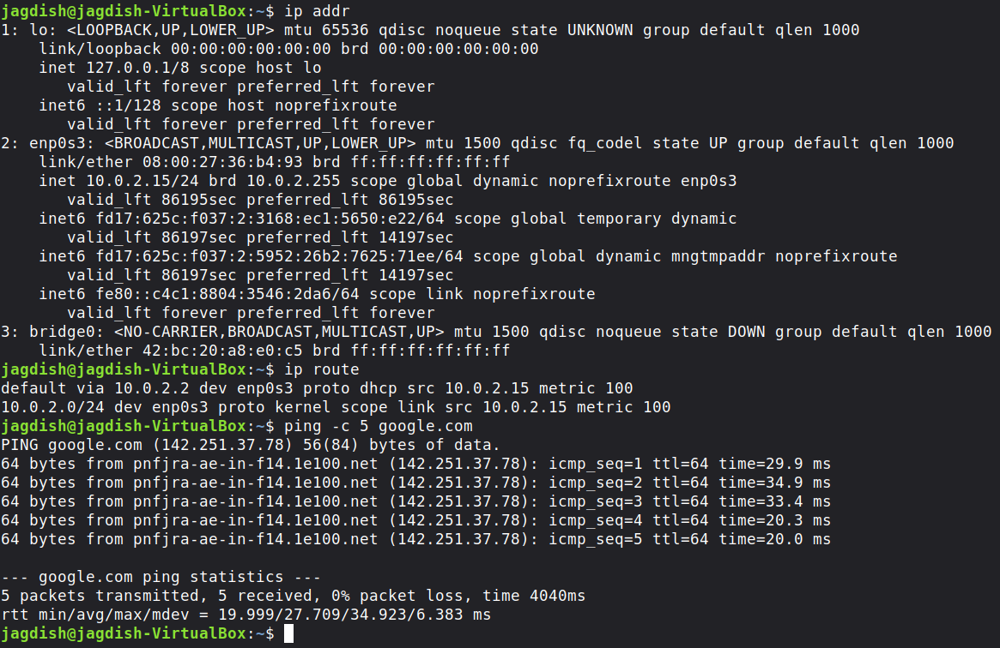
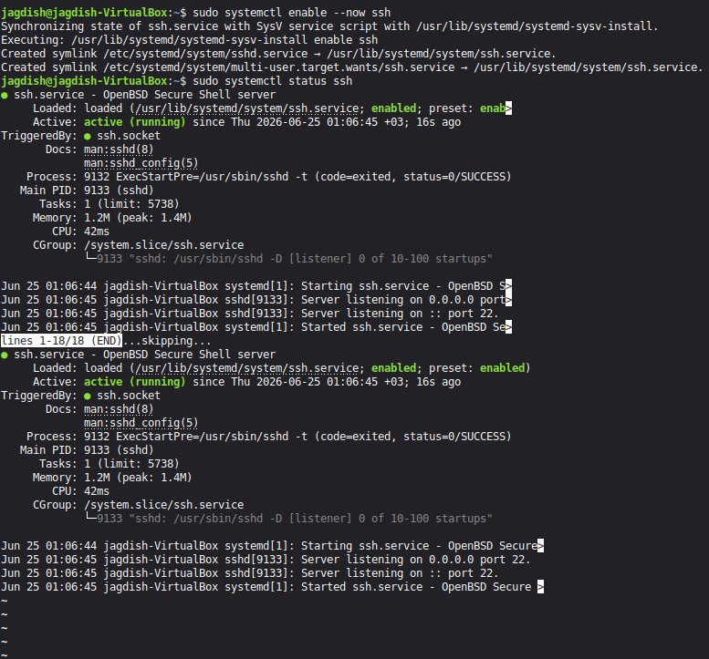
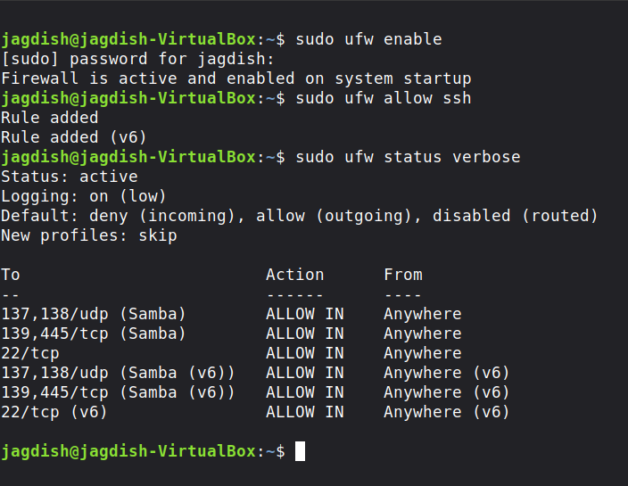

# Linux Mint VirtualBox Lab

## Overview

This lab documents the deployment and configuration of a Linux Mint virtual machine using Oracle VirtualBox on Windows 11.

The objective was to build a practical Linux environment for learning Linux administration, networking fundamentals, SSH services, firewall management, and virtualization concepts without requiring dedicated hardware.

---

## Lab Objectives

- Deploy Linux Mint inside Oracle VirtualBox
- Understand virtual machine configuration
- Verify Linux installation
- Explore Linux networking
- Test Internet connectivity
- Configure OpenSSH Server
- Enable SSH service using systemd
- Configure UFW Firewall
- Prepare a reusable Linux practice environment

---

## Environment

| Component | Details |
|------------|----------|
| Host OS | Windows 11 |
| Hypervisor | Oracle VirtualBox |
| Guest OS | Linux Mint 22.3 Cinnamon |
| Architecture | x86_64 |
| RAM | 5 GB |
| CPU | 3 Virtual Processors |
| Disk | 50 GB Virtual Disk |
| Network Mode | NAT |

---

# What I Practiced

- Virtual machine creation
- Linux installation
- Virtual hardware configuration
- Terminal navigation
- Hostname verification
- Kernel verification
- Linux system information
- Network interface inspection
- Routing table inspection
- Internet connectivity testing
- OpenSSH installation
- SSH service management using systemd
- Firewall configuration using UFW
- Linux troubleshooting

---

# Commands Used

```bash
hostnamectl

uname -a

neofetch

ip addr

ip route

ping -c 5 google.com

sudo apt install openssh-server

sudo systemctl enable --now ssh

sudo systemctl status ssh

sudo ufw enable

sudo ufw allow ssh

sudo ufw status verbose
```

---

# Skills Demonstrated

- Linux Administration
- Virtualization
- Oracle VirtualBox
- Package Management
- Network Configuration
- SSH Server
- Firewall Management
- Linux CLI
- System Services
- Troubleshooting

---

# Screenshots

## 1. Virtual Machine Configuration



**Description**

- Oracle VirtualBox configuration
- Linux Mint virtual machine
- CPU allocation
- Memory allocation
- Storage configuration
- Network adapter configuration

---

## 2. Linux Installation Verification



**Description**

Verified:

- Linux Mint version
- Hostname
- Kernel version
- Architecture
- Hardware information
- VirtualBox environment
- System information using:

```bash
hostnamectl
uname -a
neofetch
```

---

## 3. Network Connectivity



**Description**

Verified:

- Network interfaces
- Assigned IP address
- Routing table
- Internet connectivity

Commands:

```bash
ip addr

ip route

ping google.com
```

---

## 4. SSH Server Configuration



**Description**

Installed and enabled the OpenSSH server.

Verified:

- SSH installation
- Service status
- Automatic startup using systemd

Commands:

```bash
sudo systemctl enable --now ssh

sudo systemctl status ssh
```

---

## 5. Firewall Configuration



**Description**

Configured UFW firewall.

Allowed:

- SSH
- Samba ports

Verified firewall rules using:

```bash
sudo ufw status verbose
```

---

# What I Learned

Through this lab I learned how Linux virtual machines are deployed and managed inside Oracle VirtualBox. I gained practical experience with Linux networking, service management, SSH configuration, and firewall administration.

This lab also strengthened my understanding of:

- Linux command-line operations
- systemd services
- UFW firewall
- Virtual networking
- Linux troubleshooting
- Infrastructure fundamentals

---

# Future Improvements

- Configure Shared Folders
- Install VirtualBox Guest Additions
- Configure Bridged Networking
- Practice SSH from Windows host
- Configure Samba File Sharing
- Practice NFS
- Install Docker
- Build Apache/Nginx web server
- Practice LVM and disk management

---

# Technologies Used

- Linux Mint
- Oracle VirtualBox
- Bash
- OpenSSH
- systemd
- UFW Firewall
- Linux Networking