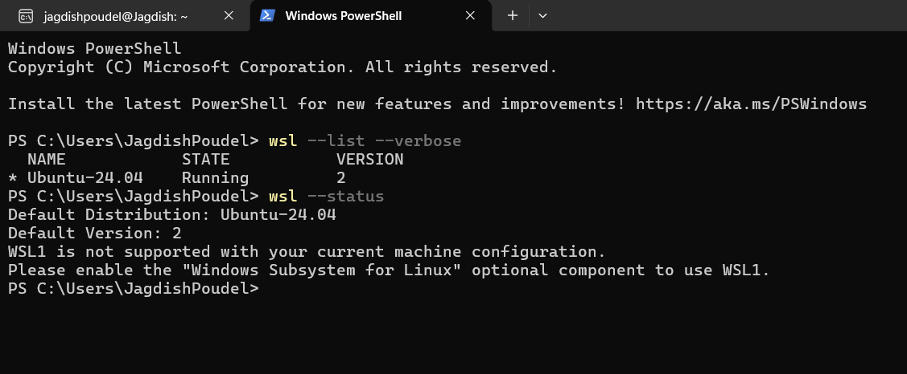
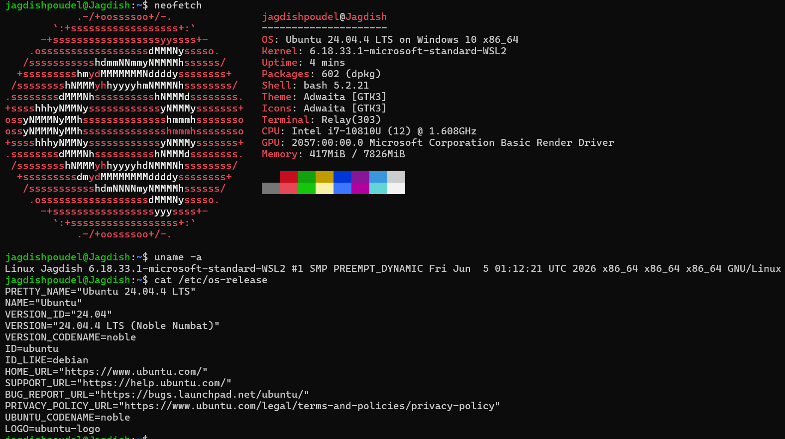
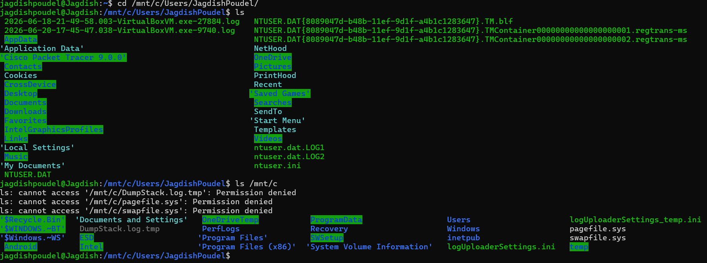
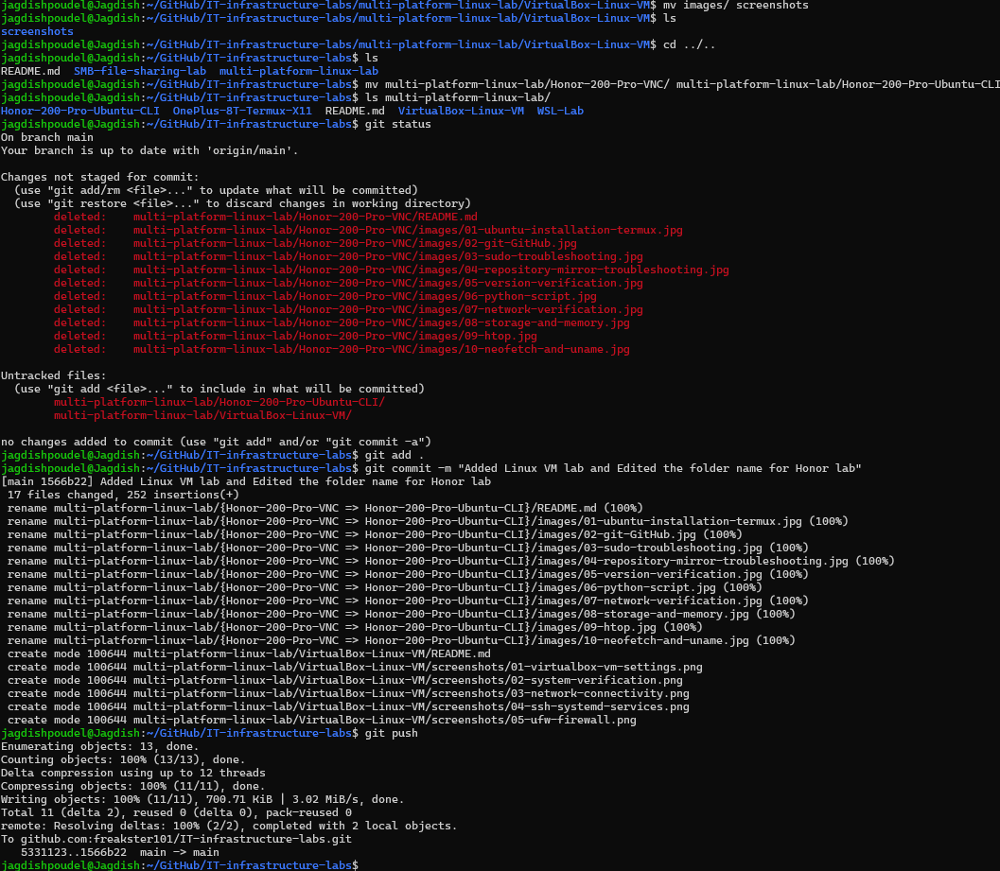
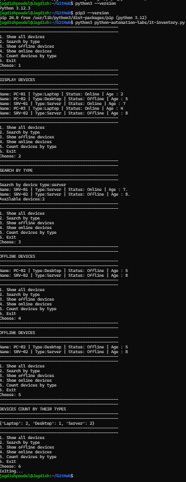

# Windows Subsystem for Linux (WSL2) Lab

## Overview

This lab documents my Windows Subsystem for Linux (WSL2) environment running Ubuntu 24.04 LTS on Windows 11.

The goal of this lab was to build a lightweight Linux development environment integrated with Windows for command-line practice, GitHub workflows, Python development, and Linux administration without requiring a full virtual machine.

---

## Objectives

- Install and configure WSL2
- Deploy Ubuntu 24.04 LTS
- Verify Linux environment
- Explore Windows-Linux file system integration
- Practice Git and GitHub workflows
- Develop Python applications inside Linux
- Build a portable Linux development environment

---

# Environment

| Component | Details |
|------------|----------|
| Host OS | Windows 11 |
| Linux Distribution | Ubuntu 24.04.4 LTS |
| Platform | Windows Subsystem for Linux 2 (WSL2) |
| Architecture | x86_64 |
| Shell | Bash |
| Package Manager | APT |
| Version | WSL2 |

---

# Skills Practiced

- WSL2 installation
- Ubuntu administration
- Linux command line
- Windows-Linux interoperability
- File system navigation
- Git
- GitHub
- Python development
- Linux package management
- Software development workflow

---

# Commands Used

```bash
wsl --list --verbose

wsl --status

neofetch

uname -a

cat /etc/os-release

cd /mnt/c

ls

git status

git add .

git commit

git push

python3 --version

python3 inventory.py
```

---

# Technologies Used

- Windows 11
- WSL2
- Ubuntu 24.04 LTS
- Bash
- Git
- GitHub
- Python 3
- APT

---

# Screenshots

## 1. WSL Installation Verification



### Description

Verified the WSL environment from Windows PowerShell.

Confirmed:

- WSL2 installation
- Ubuntu distribution
- Running status
- Default Linux distribution
- WSL version

Commands

```powershell
wsl --list --verbose

wsl --status
```

---

## 2. Ubuntu Environment Verification



### Description

Verified the Linux environment using:

- neofetch
- uname
- OS release information

Confirmed:

- Ubuntu version
- Linux kernel
- Architecture
- Memory
- CPU
- Shell
- Distribution information

Commands

```bash
neofetch

uname -a

cat /etc/os-release
```

---

## 3. Windows and Linux File System Integration



### Description

Explored Windows drives from Linux through the `/mnt` directory.

Practiced:

- Accessing Windows files
- Navigating Windows directories
- Understanding mounted drives
- Cross-platform file management

Commands

```bash
cd /mnt/c

ls

cd /mnt/c/Users/<username>
```

---

## 4. Git & GitHub Workflow



### Description

Managed project files directly from the Linux terminal.

Tasks performed:

- Renamed project folders
- Checked repository status
- Added changes
- Created commits
- Pushed updates to GitHub

Commands

```bash
git status

git add .

git commit

git push
```

---

## 5. Python Development



### Description

Executed Python projects directly inside Ubuntu.

Projects tested:

- IT Inventory System
- Python CLI application

Verified:

- Python installation
- Program execution
- Linux development workflow

Commands

```bash
python3 --version

python3 inventory.py
```

---

# What I Learned

This lab helped me understand how WSL2 integrates Linux directly into Windows without requiring virtualization.

I gained practical experience with:

- Linux command-line operations
- Cross-platform file management
- Git and GitHub workflows
- Python development inside Linux
- Ubuntu package management
- Windows-Linux interoperability
- Development using a native Linux environment

---

# Future Improvements

- Configure SSH server inside WSL
- Docker on WSL2
- VS Code Remote WSL
- Bash scripting
- Python automation projects
- Cron jobs
- Nginx web server
- Networking tools
- Shell customization
- Package management automation

---

# Key Takeaways

- Installed and configured Ubuntu using WSL2
- Verified Linux environment
- Navigated Windows drives from Linux
- Managed GitHub repositories entirely from Linux
- Developed and executed Python applications
- Built a practical Linux development environment integrated with Windows